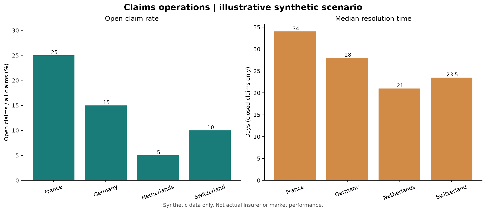

# Claims Operations: Analyst Foundations

> **Portfolio project · synthetic data · introductory scope**

This first-stage case study practices the data-analytics lifecycle on a small, fully reproducible claims scenario. Every row is generated for this project; the dataset does **not** represent an insurer, real customers, operational performance or actual European markets.

## Business question

In this illustrative scenario, which market segments have the largest open-claim backlog, and how does the resolution time of closed claims vary across markets?

The purpose is to practice translating a broad operational concern into measurable questions—not to make a real-world claims recommendation.

## What is included

- A documented business question and KPI definitions.
- A deterministic synthetic CSV with a data dictionary.
- Basic data-quality checks for schema, duplicate IDs, missing values, amounts and status/date consistency.
- Segment-level descriptive summaries and a labeled visualization.
- A written project brief suitable for sharing, including methods and limitations.

## KPIs

| KPI | Definition |
|---|---|
| Open claims | Count of rows whose status is `Open`. |
| Open-claim rate | Open claims divided by all claims in that market. |
| Median resolution days | Median of `closed_date - reported_date` for closed claims only. Open claims are excluded. |
| Incurred amount (EUR) | Sum of the illustrative `incurred_amount_eur` field; it is not a paid-loss or profitability measure. |

The scenario snapshot is **April 30, 2025**. Field-level definitions and nullability are documented in the [data dictionary](docs/DATA_DICTIONARY.md).

## Illustrative results

These figures describe only the generated scenario and are not real-world findings.

| Market | Claims | Open claims | Open-claim rate | Median resolution days |
|---|---:|---:|---:|---:|
| France | 60 | 15 | 25% | 34.0 |
| Germany | 60 | 9 | 15% | 28.0 |
| Netherlands | 60 | 3 | 5% | 21.0 |
| Switzerland | 60 | 6 | 10% | 23.5 |



## Reproduce

Python 3.10+ is recommended.

```powershell
py -m venv .venv
.\.venv\Scripts\Activate.ps1
py -m pip install -r requirements.txt
py src\generate_data.py
py src\analyze.py
```

The scripts run from this project directory. Outputs are written to `reports/`.

## Files

```text
data/claims.csv                     Reproducible synthetic input data
docs/DATA_DICTIONARY.md             Field meanings, types and null rules
docs/PROJECT_BRIEF.md               Shareable case-study summary
reports/project_brief.pdf           One-page shareable PDF brief
reports/market_kpis.csv             Generated KPI table
reports/market_kpis.png             Generated chart
src/generate_data.py                Deterministic sample-data generator
src/analyze.py                      Quality checks, KPI calculation and chart
```

## Interpretation guardrails

- The dataset is synthetic and intentionally small. Its patterns are not empirical findings.
- Market and product labels are scenario categories, not representative samples.
- Incurred amounts are invented scenario values and are not verified financial outcomes.
- No causal inference, statistical test, forecasting, predictive model, SQL, production Power BI report or visa/sponsorship analysis is claimed.
- The dashboard PDF in the repository is separate workshop evidence; it is not generated from this project's data.

## Next iteration

After completing the relevant learning stages, extend the same problem with a clearly sourced real dataset, SQL analysis, a documented Power BI semantic model and deeper statistical questions. Keep synthetic and real evidence clearly separated.

## Project brief

See [PROJECT_BRIEF.md](docs/PROJECT_BRIEF.md) for a concise narrative and shareable summary.
